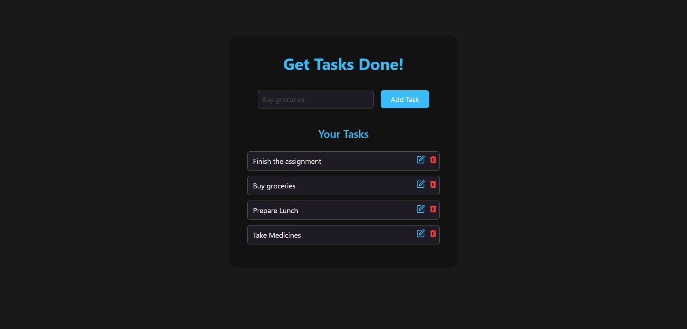
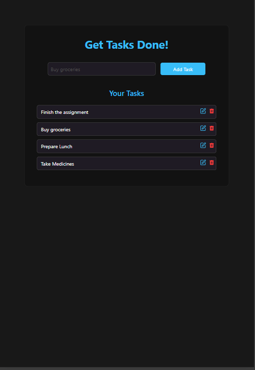
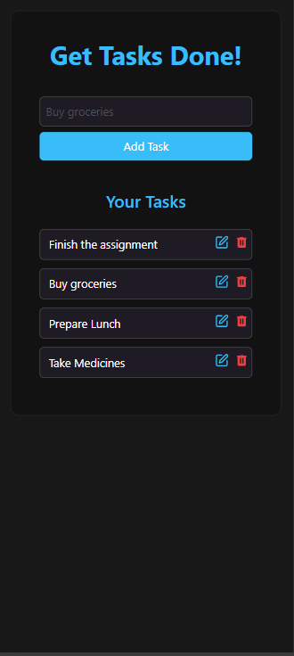

# ToDo List Application

- This project was bootstrapped with [Create React App](https://github.com/facebook/create-react-app).

- Project was made with React 18, Tailwind CSS, Redux Toolkit

- Features

  - Persistent Storage
  - Users can add, view, edit, delete tasks and mark as completed.

- Screenshot Desktop
  

- Screenshot Tablet
  

- Screenshot Mobile

  

## To run this application

- In a terminal - `git clone <repo-url> ./`
- To install dependencies - `npm install`
- To run the application - `npm run start`
- Go to localhost:3000 to use this application.
